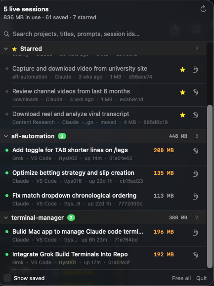

# Terminal Manager

[](https://github.com/ProximoBinks/terminal-manager)
[](https://www.swift.org)
[](LICENSE)
[](https://github.com/ProximoBinks/terminal-manager/actions/workflows/build.yml)
[](https://github.com/ProximoBinks/terminal-manager/stargazers)
[](https://github.com/ProximoBinks/terminal-manager/issues)
[](https://github.com/ProximoBinks/terminal-manager/commits/main)

A macOS menu bar app for **Claude Code** and **Grok Build**. It shows which sessions are actually running, how much RAM the whole process tree is holding (the CLI plus MCP servers and subagents), and gives you the `--resume` command so you can free a session without losing it.

<p align="center">
  
</p>

Closing a terminal does not delete the conversation. Claude writes every session to `~/.claude/projects/…/<id>.jsonl`. Grok writes every session to `~/.grok/sessions/…/<id>/`. The resume id *is* that identifier. This app makes both archives searchable, groups them by project, and lets you pause, free, or copy `cd '<dir>' && claude --resume <id>` / `grok --resume <id>`.

## Install

macOS 14 or later. No Homebrew tap yet — build from source (Xcode or the Command Line Tools):

```sh
git clone https://github.com/ProximoBinks/terminal-manager.git
cd terminal-manager
./build.sh
cp -R build/TerminalManager.app /Applications/
open /Applications/TerminalManager.app
```

Gatekeeper will block an unsigned app the first time. Right-click → **Open**, or:

```sh
xattr -cr /Applications/TerminalManager.app
```

Use the **Applications** copy for daily use (login item and Full Disk Access stick to that path). After you rebuild, copy it over again:

```sh
cp -R build/TerminalManager.app /Applications/
```

Settings (gear) → **Open at login** if you want it in the menu bar after a reboot.

## What you can do

| | |
| --- | --- |
| **See live sessions** | Menu bar shows `count · RAM`. Rows group by project. Claude and Grok in the same repo share a section. |
| **Copy resume** | The copy button is always there: `cd '<dir>' && claude --resume <id>` or `grok --resume <id>`. |
| **Pause** | Freezes the process tree (`SIGSTOP`). RAM stays; the row stays in the group. Unpause continues in the same window. |
| **Free** | Quits the CLI and its children, leaves the terminal at a shell prompt. Star the row first if you want to find it with Show saved off. |
| **Resume** | Opens a new Terminal window on the transcript. Use this after a reboot or a closed window — Pause cannot wake a process that no longer exists. |
| **Interrupted** | Sessions that vanished without Free (sleep/crash/reboot/closed terminal) stay in the same project group with Resume / Dismiss. |
| **Star and tag** | Stars pin sessions at the top. Coloured tags filter the list and split a long starred pile into labelled groups. |

Hover a row for Pause / Free / Resume — actions replace the metadata line so the list does not jump. Right-click for the rest (close the Terminal window, copy the id, reveal the transcript).

## Permissions

The first launch may ask to control **Terminal.app** (tab titles, focus, close). Without it, matching still works via `--resume` and file mtimes.

macOS also asks the first time the app looks at Desktop, Documents, or Downloads. That is a session whose project lives there, not a scan of your whole disk. Allow once per *copy* of the app, or Settings → **Open Full Disk Access…** and add the Applications copy.

**Reload** in the header force-rescans if the list looks empty after sleep. `ps` / `lsof` can hang on wake; the app times those out and rescans automatically.

## How a running process is matched

Claude and Grok are matched independently (a Grok process never claims a Claude transcript).

1. **Grok live registry** — `~/.grok/active_sessions.json` maps pid → session id, so a plain `grok` with no `--resume` still resolves.
2. **Tab title** — Claude writes `ai-title` into the transcript and the Terminal tab; an exact match is definitive.
3. **`--resume <id>`** — only if that transcript has been written since the process started (resume often forks a new id).
4. **Newest transcript** in that project folder.
5. **The `--resume` id anyway**, so the UI shows an id rather than nothing.

Project grouping uses Claude’s folder encoding (non-alphanumerics → `-`) for both CLIs, so both tools in one repo land in one section. Nested Claude subagent jsonl files are skipped; Grok subagent processes are counted in the parent’s RAM.

If you moved the project folder, the app searches the filesystem and labels the row **moved** (command cds to the new path) or **folder missing** (bare `--resume`, Resume disabled).

## Command line

Same engine, no menu bar — useful in PRs and when matching looks wrong:

```sh
.build/release/TerminalManager --dump              # live sessions, RAM, how each was matched
.build/release/TerminalManager --groups            # sections as the menu renders them
.build/release/TerminalManager --sessions <filter> # transcripts matching a substring
.build/release/TerminalManager --star <id>         # toggle a star
.build/release/TerminalManager --free <pid>        # terminate one process tree
.build/release/TerminalManager --pause <pid>       # SIGSTOP
.build/release/TerminalManager --unpause <pid>     # SIGCONT
```

State lives in `~/Library/Application Support/TerminalManager/` (`starred.json`, `tags.json`, `preferences.json`, `session-index.json`). Transcripts stay where Claude and Grok put them.

## Contributing

See [CONTRIBUTING.md](CONTRIBUTING.md). Bug reports that include `--dump` output are much easier to act on. This project follows the [Contributor Covenant](CODE_OF_CONDUCT.md).

## Star history

[](https://www.star-history.com/#ProximoBinks/terminal-manager&Date)

## License

[MIT](LICENSE)
